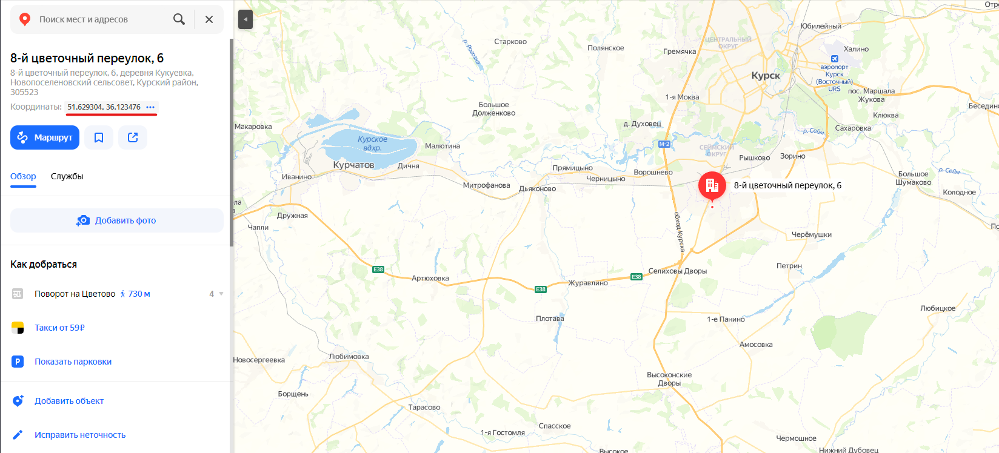
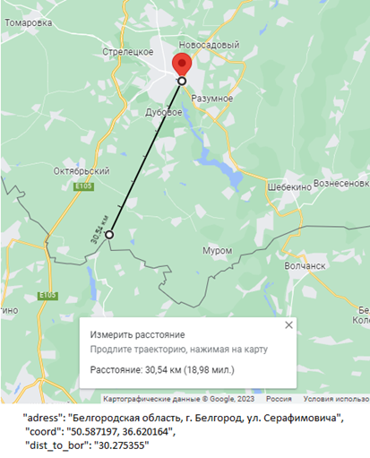

# Проект Distances_to_the_Ukrainian_border

## Оглавление  
[1. Описание проекта](README.md#Описание-проекта)   
[2. Библиотеки](README.md#Библиотеки)  
[3. Входные данные](README.md#Входные-данные)  
[4. Как решал?](README.md#Как-решал?)    
[6. Результаты](README.md#Результатыы)  
[7. Выводы](README.md#Выводы) 

### Описание проекта    
Программа для поиска дистанции между адресами и границей без дополнительных финансовых влажений 

### Библиотеки
В данном проекте использовались библиотеки:

- Pandas
- Selenium
- Plot
- Geopy

### Входные данные
Файл в формате "xlsx", где:
- Столбец A: Город
- Сьолбец B: Полный адрес

### Как решал?

Решил разбить задачу на 4 этапа. Каждый этап разбит на отдельный файл.
1. Поиск координат границы. 
 Файл: [Finding_boundary_coordinates](Finding_boundary_coordinates.ipynb)
   
2. Предобработка данных
 Файл: [Processing_of_input_data](Processing_of_input_data.ipynb)
    
3. Поиск координат адресов
 Файл: [Selenium](selenium/main.py)
   
4. Расчет дистанции
 Файл: [Calculation_of_distance](Calculation_of_distance.ipynb)
   

### Результаты:
В результате получили дистанцию адресов и dataframe, где:
* adress - полный адрес объекта
* coord - координаты объекта
* dist_to_bor - дистанция до границы

### Вывод:

К конце можно можно сделать небольшой вывод:

✅ Поставленный кейс выполнил;
 ✅ Решил задачу без финансовых вложений;
 ✅ Попрактиковал библиотеки pandas, selenium, plot, geopy; 
 ✅ Погрешность в дистанциии в пределах нормы;

По данной задаче и пути её решения написана статья:

Если информация по этому проекту покажется вам интересной или полезной, то я буду очень вам благодарен, если отметите репозиторий и профиль ⭐️⭐️⭐️-дами
